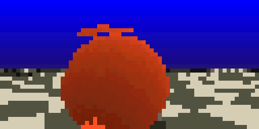

# NAND-16: From Transistors to Raytracer

This learning project implements, end to end in Go, a CPU, a Forth cross-compiler,
and a full raytracer, starting from a hierarchical NAND-gate design.

## Output



An orbiting camera circles two spheres above a checkerboard ground.
The renderer uses quadratic sphere intersection, normal calculation,
Half-Lambert diffuse shading plus Phong specular reflection,
shadow rays, and a checkerboard ground.
Everything is computed using 8.8 fixed-point arithmetic on a 64×32 RGB555 framebuffer.

## Build and Run

The whole toolchain is wrapped in [run.sh](run.sh):

```bash
./run.sh                 # → raytracer_rgb555.png
```

The animation loops forever; the PNG is overwritten every 10,000 CPU ticks, so
it can be watched live in an auto-reloading image viewer (Ctrl-C to stop).

`run.sh` runs:

```bash
# Assemble the BIOS (loaded at 0x0000)
go run ./cmd/asmc -o bin/bios.bin asm/bios.s

# Compile the Forth raytracer to assembly, then assemble it for load @ 0x0200
go run ./cmd/forthc -o bin/raytracer.s asm/raytracer.fth
go run ./cmd/asmc -base 0x0200 -o bin/raytracer.bin bin/raytracer.s

# Run: BIOS @ 0x0000 + app @ 0x0200, snapshotting the framebuffer every 10,000 ticks
go run ./cmd/nand16 -png raytracer_rgb555.png -every 10000 bin/bios.bin bin/raytracer.bin
```

Run the test suite separately:

```bash
go test ./...            # 72 tests across all packages
```

## Architecture Layers

### Layer 1 — Gate Simulator

`internal/nand16/`: `wire.go` `gate.go` `flipflop.go` `simulator.go`

An event-driven digital logic simulator built from NMOS-based NAND gates,
D flip-flops, and buses.

### Layer 2 — Combinational Logic

`internal/nand16/`: `logic_basic.go` `logic_arith.go` `logic_shift.go`

NOT, AND, OR, XOR, MUX, full adders, 16-bit adders/subtractors,
barrel shifters, and comparators.
All are constructed hierarchically from NAND gates.

### Layer 3 — Sequential Circuits

`internal/nand16/`: `sequential.go` `membus.go` `module.go`

16-bit registers, a register file (8×16-bit), a program counter, and a memory bus port.

### Layer 4 — CPU: NAND-16

The project ships **two interchangeable CPU models** that share the opcode and
encoding definitions in `internal/op/code.go`:

- **Gate-level** (`internal/nand16/`: `cpu.go` `cpu_alu.go` `cpu_mul.go`) —
  `GateCPU`, a single-cycle core built entirely from the gate primitives above.
- **Behavioral** (`internal/cpu/cpu.go`) — a fast Go implementation used to drive
  the SoC and render the raytracer.

An ALU conformance test (`internal/cpu/alu_conformance_test.go`) and the
integration tests (`internal/integration/`) keep the two models bit-identical.

| Item | Specification |
|---|---|
| Word width | 16-bit |
| Registers | R0–R7 (R0 = zero, R6 = SP, R7 = link) |
| Instruction width | 16-bit fixed |
| Instruction formats | R/I/B/J-type |
| ALU | ADD SUB AND OR XOR SHL SHR SRA |
| Multiply | MUL(low16) / MULH(high16) |
| Memory | 64 KB byte-addressed, little-endian |
| FB | 64×32, mapped at 0xF000 (RGB555) |
| I/O | UART at 0xF800, Timer at 0xF810 |

### Layer 5 — SoC / BIOS

`internal/system/`: `system.go` `device.go` + `asm/bios.s`

SoC integration (CPU + memory + FB + UART + Timer).
The BIOS is plain assembly source ([asm/bios.s](asm/bios.s)) assembled by the `asmc` CLI; it
boots the machine and provides I/O entirely in software via memory-mapped device registers.

### Layer 6 — Assembler

`internal/asmc/`: `assembler.go` `emit.go` + `cmd/asmc`

A two-pass assembler supporting labels, all instruction formats, and pseudo-ops.

### Layer 7 — Forth Cross-Compiler

`internal/forthc/forth.go` + `cmd/forthc`

Compiles Forth source into NAND-16 machine code.

**Register convention**: R4 = TOS (cache), R6 = data stack, R5 = return stack

**Runtime**: `_udiv` (unsigned 16-bit shift-subtract division, 16 iterations)

**Word calls**: the prologue saves R7 into RSP, then the body executes, and the epilogue restores and returns with RET.
Calls beyond the 12-bit JAL range automatically fall back to register-based JALR (long call).

| Category | Words |
|---|---|
| Arithmetic | `+ - * negate abs` |
| Fixed-point | `f*` (8.8 multiply), `f/` (signed extended-precision divide), `*/` |
| Integer division | `/ mod` |
| Comparisons | `= <> < > 0= 0< 0> max min` |
| Stack | `dup drop swap over rot nip 2dup` |
| Memory | `@ ! c@ c!` |
| Control | `if else then` `begin until again` `while repeat` `do loop i j` |
| Drawing | `pixel` (8 bpp), `pixel16` (RGB555) |
| Math | `isqrt` (Newton method), `fsqrt` (fixed-point square root) |

**Constant-load optimization**: direct imm6 → 2-step ADDI → shift construction (`hi<<8+lo`) → LUI → long load.
Shift construction is preferred; even large negative values can be generated in 3–8 instructions (down from 30+ instructions in the old LUI-only approach).

**f/ sign handling**: save the dividend sign → absolute value → unsigned division → restore sign.
The previous implementation incorrectly handled negative dividends with logical right shift (SHR),
which corrupted normal calculations at x/y sign boundaries and caused spheres to split into four quadrants.

### Layer 8 — Raytracer

`cmd/nand16/main.go` + `asm/raytracer.fth` + `internal/render`

Real-time raytracing using 8.8 fixed-point arithmetic. The CPU runner drives the
SoC and snapshots the framebuffer to PNG via `internal/render`.

**Ray generation**: camera origin, pixel → screen coordinates → ray direction `(rx, ry, -256)`

**Orbiting camera**: a 24-entry sine table drives a camera that circles the scene
(orbit radius 448, centre `(0,0,-448)`, 15° yaw per frame plus a vertical bob);
the ray direction is rotated by the current yaw each frame.

**Sphere intersection**: quadratic discriminant method with overflow avoidance
```
oc = -C,  a = dot(d,d),  bh = dot(oc,d),  c = dot(oc,oc) - r²
disc = bh² - a·c,  t = (-bh - √disc) / a
```

**Normal**: `N = (P - C) / r` (accurate across all quadrants with signed `f/`)

**Lighting model**: Half-Lambert diffuse + Phong specular reflection (squared)
```
half = (dot(N,L) + 1.0) / 2      ← no terminator line
total = half × 0.625 + spec² × 0.3 + ambient
channel = base_color × total      ← no hue shift
```
Light source: directional light `L = normalize(-1, 1, 1)` and half-vector `H = normalize(L + V)`

**Shadow rays**: intersection test from the ground hit point toward the light direction.
If the discriminant `dot(oc,L)² - (dot(oc,oc) - r²) ≥ 0` is satisfied, the point is considered in shadow and brightness is halved.

**Scene setup**:
- Warm sphere: center(80, 0, -512), r=128, base(31, 10, 4)
- Cool sphere: center(-80, -32, -384), r=96, base(6, 18, 31)
- Ground: y=-128, checkerboard (bit8 XOR approach, sign-safe)
- Background: blue gradient + warm horizon

**Forth source**: 9 defined words `isqrt` `fsqrt` `clamp0` `sin@` `ground-t` `sphere-hit` `shade` `shadow?` `setup-cam`, plus a sine-table init and the main animation loop

## Numerical Summary

| Item | Value |
|---|---|
| Implementation lines (Go) | ~3,200 |
| Test lines (Go) | ~1,800 |
| Test count | 72 |
| Behavioral CPU speed | ~55M instructions/sec |
| Gate-level ALU | ~3,230 NAND gates |
| Raytracer machine code | 9,282 bytes |
| Default run | 500M-cycle budget (~9.5 s wall-clock), animation loops |
| Resolution | 64×32 RGB555 (15 bit/pixel) |
| PNG output | 512×256 (8× upscale) |

## File Layout

```
nand16/
├── internal/
│   ├── nand16/             # Layers 1–4: gate-level model
│   │   ├── wire.go             # wires and buses
│   │   ├── gate.go             # NAND gates
│   │   ├── flipflop.go         # D flip-flops
│   │   ├── simulator.go        # event-driven simulator
│   │   ├── logic_basic.go      # NOT AND OR XOR MUX
│   │   ├── logic_arith.go      # adders/subtractors/comparators
│   │   ├── logic_shift.go      # barrel shifters
│   │   ├── sequential.go       # registers and register file
│   │   ├── membus.go           # memory bus port
│   │   ├── module.go           # module foundation
│   │   ├── cpu.go              # gate-level GateCPU
│   │   ├── cpu_alu.go          # gate-level ALU
│   │   └── cpu_mul.go          # gate-level multiplier
│   ├── op/code.go          # opcode / encoding definitions (shared)
│   ├── cpu/cpu.go          # behavioral CPU (fast simulation)
│   ├── memory/memory.go    # 64KB byte-addressed memory
│   ├── system/             # SoC: system.go + device.go (FB/UART/Timer)
│   ├── asmc/               # 2-pass assembler (assembler.go, emit.go)
│   ├── forthc/forth.go     # Forth cross-compiler
│   ├── render/png.go       # framebuffer → PNG
│   └── integration/        # cross-model + SoC integration tests
├── cmd/
│   ├── asmc/main.go        # assembler CLI (.s → .bin)
│   ├── forthc/main.go      # Forth compiler CLI (.fth → .s)
│   └── nand16/main.go      # CPU runner (.bin → PNG)
├── asm/
│   ├── bios.s              # BIOS assembly source
│   └── raytracer.fth       # raytracer Forth source
├── run.sh
├── README.md
├── go.mod
└── raytracer_rgb555.png    # output image
```
